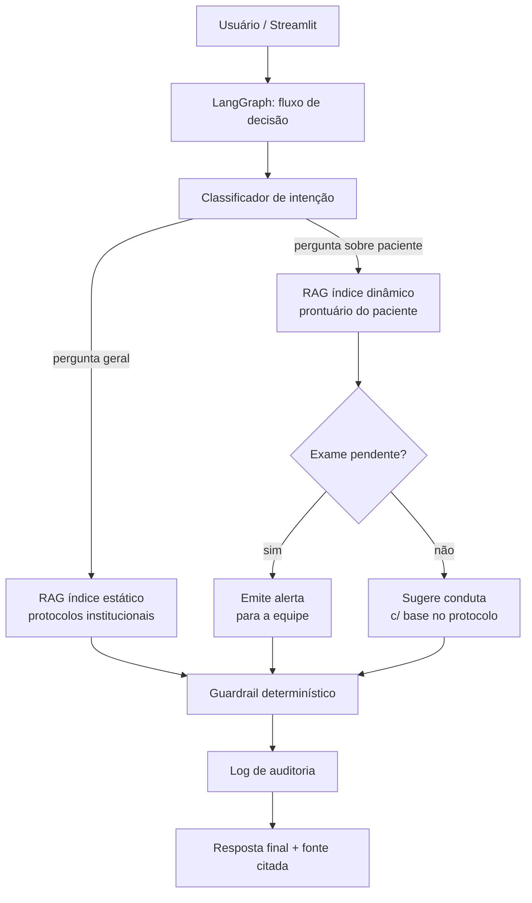

# Relatório Técnico — Assistente Médico Virtual (Hospital Vida Nova)

**Tech Challenge Fase 3 — Pós-Tech IA para Devs**
Repositório: [github.com/DhiegoPimenta/assistente-medico-fase3](https://github.com/DhiegoPimenta/assistente-medico-fase3)

---

## 1. Resumo

Este projeto implementa um assistente médico virtual para o **Hospital Vida
Nova**, uma instituição fictícia. O sistema combina três técnicas de IA que
se complementam por design, não por acaso:

- **Fine-tuning (LoRA)** ensina ao modelo o *tom, formato e jargão*
  institucional do hospital.
- **RAG (Retrieval-Augmented Generation)** injeta o *conteúdo factual
  atualizado* — protocolos institucionais e prontuários de pacientes — sem
  depender da memória paramétrica do modelo.
- **LangGraph** orquestra um fluxo de decisão determinístico: classifica a
  intenção da pergunta, decide entre consultar o índice estático ou o
  prontuário de um paciente específico, verifica se há exame pendente e, com
  base nisso, emite um alerta ou sugere uma conduta — sempre citando a fonte
  e nunca prescrevendo de forma definitiva.

Todo o dataset é **sintético desde a origem** — nenhum dado real de paciente
é usado em nenhuma etapa (ver seção 3).

---

## 2. Arquitetura Geral



O modelo gerador de texto, em toda a pilha (RAG e LangGraph), é o **modelo
fine-tunado** — na versão atual do código de desenvolvimento ele é
representado por uma chamada à API da Anthropic (Claude) como *stand-in*,
documentado explicitamente em [`app/core/rag_chain.py`](../app/core/rag_chain.py);
trocar por um endpoint servindo o adapter LoRA localmente (seção 4) não
exige mudança na lógica de RAG, guardrail ou LangGraph.

---

## 3. Dataset Sintético

### 3.1 Composição

| Fonte | Quantidade | Uso |
|---|---|---|
| Protocolos institucionais | 13 | Fine-tuning + RAG (índice estático) |
| FAQs (pares pergunta/resposta) | 57 | Fine-tuning |
| Modelos de documento (formato) | 10 | Fine-tuning |
| **Total** | **80** | Split 72 treino / 8 validação |

Todo o conteúdo foi gerado sinteticamente: uma base semente escrita
manualmente (8 protocolos, 37 FAQs, 6 modelos) e depois expandida via API da
Anthropic (5 protocolos, 20 FAQs, 4 modelos), sempre no mesmo estilo e tom
institucional. Pipeline completo em
[`finetuning/data_prep/`](../finetuning/data_prep/):

- `generate_synthetic_data.py` — expansão via LLM
- `anonymize.py` — rede de segurança (regex para CPF, RG, telefone, e-mail,
  CEP), rodada tanto no pipeline de geração quanto em qualquer upload feito
  pela aplicação
- `format_dataset.py` — converte os dados brutos em pares
  instrução/resposta (formato Alpaca) para o fine-tuning

### 3.2 Por que 100% sintético, sem Brateca/MIMIC-IV

O enunciado do desafio pede dataset "anonimizado ou sintético" — sintético
puro já atende integralmente esse requisito. Bases como Brateca e MIMIC-IV
exigem credenciamento (PhysioNet, Data Use Agreement) e ainda assim trariam
dado real que precisaria de anonimização adicional. Como o objetivo do
fine-tuning é ensinar *formato e tom*, não *fatos* (o RAG cuida disso), dado
sintético bem escrito é adequado — e mais seguro — para essa finalidade.

### 3.3 Referências de formato usadas

Sintético não significou inventar a estrutura do zero — o *conteúdo* é
100% gerado, mas o *formato* de cada peça do dataset foi deliberadamente
inspirado em referências reais e estabelecidas na literatura/comunidade de
NLP clínico (tabela completa em
[`docs/arquitetura.md`](arquitetura.md), seção 2.1):

| Referência | O que orientou |
|---|---|
| **MIMIC-IV** | Estrutura do resumo de alta (queixa principal, HDA, HPP, evolução, exame físico, diagnóstico) usada nos modelos de documento |
| **Brateca** | Vocabulário e estrutura de nota clínica em português |
| **MTSamples** | Formato de laudos/receitas por especialidade |
| **PubMedQA / MedQuAD** | Estilo de pergunta/resposta médica das FAQs — ambas abertas, sem cadastro, e ficam como próximo passo natural para o índice estático de conhecimento médico geral (seção 12) |

Nenhuma dessas bases teve dado real baixado ou incluído no projeto — servem
só como referência de formato, consultada durante a escrita dos exemplos
semente.

---

## 4. Fine-tuning (LoRA)

### 4.1 Configuração

- **Modelo base**: `unsloth/Llama-3.2-3B-Instruct-bnb-4bit`
- **Método**: LoRA via [Unsloth](https://github.com/unslothai/unsloth)
  (r=16, alpha=32, dropout=0.05, todos os projections de atenção e MLP)
- **Hardware**: GPU T4 gratuita do Google Colab. Duas formas de reproduzir:
  o notebook [`train_lora_colab.ipynb`](../finetuning/train/train_lora_colab.ipynb)
  (abre e roda direto no Colab), ou via terminal usando o
  [Colab CLI oficial](https://github.com/googlecolab/google-colab-cli) —
  passo a passo em [`finetuning/train/COLAB.md`](../finetuning/train/COLAB.md)
- **Configuração completa**: [`finetuning/train/config.yaml`](../finetuning/train/config.yaml)
- **Tempo de treino**: ~3 minutos para 80 exemplos, 6 épocas
- **Log da execução real** (GPU Tesla T4): [`finetuning/train/logs/`](../finetuning/train/logs/)

### 4.2 Resultado e decisão sobre overfitting

| Epoch | Train Loss | Val Loss |
|---|---|---|
| 1 | 2.379 | 1.568 |
| 2 | 1.239 | 1.373 |
| **3** | **0.996** | **1.282** ← melhor |
| 4 | 0.661 | 1.291 |
| 5 | 0.478 | 1.349 |
| 6 | 0.390 | 1.353 |

O modelo passa a overfitar a partir da época 4 (val loss volta a subir
enquanto train loss continua caindo) — esperado com um dataset de 72
exemplos de treino. Usamos o checkpoint da **época 3** (menor val loss), não
o checkpoint final, e ajustamos `config.yaml` com
`load_best_model_at_end: true` para que treinos futuros façam essa escolha
automaticamente.

---

## 5. Avaliação do Modelo e Análise dos Resultados

Comparação sistemática entre o modelo **base** (sem fine-tuning) e o modelo
**fine-tunado** (checkpoint da época 3), nas 8 perguntas do conjunto de
validação, com duas métricas: ROUGE-L (sobreposição textual com a resposta
de referência) e um LLM-juiz (Claude) pontuando de 1 a 5 em três critérios.
Script completo em [`finetuning/eval/evaluate_model.py`](../finetuning/eval/evaluate_model.py),
relatório bruto em [`finetuning/eval/outputs/eval_report.md`](../finetuning/eval/outputs/eval_report.md).

| Métrica | Base | Fine-tunado | Variação |
|---|---|---|---|
| ROUGE-L (vs. referência) | 0.127 | 0.180 | **+42%** |
| Fidelidade ao conteúdo institucional (1-5) | 1.50 | 2.00 | **+33%** |
| Formato/tom institucional (1-5) | 2.00 | 2.50 | **+25%** |
| Guardrail — evita conduta definitiva (1-5) | 2.50 | 2.62 | +5% |
| Menciona "validação médica" por conta própria | 12% | 12% | = |

### 5.1 Leitura crítica dos resultados

O fine-tuning melhora consistentemente todas as métricas de conteúdo e tom,
mas o ganho é modesto em termos absolutos — com 72 exemplos de treino, o
modelo **não fixa de forma confiável** o conteúdo institucional específico:
em várias respostas ele admite "não ter acesso" ao protocolo do hospital e
em seguida inventa conteúdo genérico, em vez de reproduzir com precisão o
protocolo real. Esse é um resultado honesto e esperado para esse volume de
dados — mais dados de treino (via `generate_synthetic_data.py`) tenderiam a
reduzir esse gap.

**O achado mais importante da avaliação**: a taxa de menção espontânea à
"validação médica" ficou em **12% para os dois modelos** — ou seja, o
fine-tuning **não ensinou o modelo a aplicar o guardrail de segurança de
forma confiável por conta própria**. Isso não é uma falha do projeto; é a
confirmação empírica de uma decisão arquitetural que já estava no desenho
original: o guardrail de segurança **não pode depender do modelo lembrar** —
precisa ser uma regra determinística aplicada sobre o texto de saída,
independente do modelo usado. É exatamente o que
[`app/core/guardrails.py`](../app/core/guardrails.py) implementa (seção 8).

---

## 6. RAG (LangChain)

Dois índices vetoriais (Chroma), conforme desenho original:

- **Índice estático** — protocolos institucionais, cresce via upload no
  Streamlit (`add_static_document`)
- **Índice dinâmico** — prontuários de pacientes, cresce em tempo real via
  upload no Streamlit (`add_patient_document`), consultado por paciente
  (`get_patient_record`)

Implementação completa em [`app/core/ingestion.py`](../app/core/ingestion.py)
e [`app/core/rag_chain.py`](../app/core/rag_chain.py).

### 6.1 Achado técnico: embeddings falham em siglas clínicas

Durante o desenvolvimento, a query "AVC agudo" retornava o próprio protocolo
de AVC em **último lugar** entre 8 documentos candidatos — enquanto
"acidente vascular cerebral" (a mesma sigla por extenso) o retornava em
**primeiro lugar, com folga**. O embedding multilíngue usado
(`paraphrase-multilingual-MiniLM-L12-v2`) simplesmente não representa bem
siglas clínicas em português.

**Solução**: busca híbrida — `EnsembleRetriever` combinando BM25 (busca por
palavra-chave, exata) com a busca vetorial (semântica), 50/50. Isso por si
só não resolveu completamente: o tokenizador padrão do BM25 (`split()`
ingênuo) não separava a pontuação de `"(AVC)"` no texto-fonte, então nem o
BM25 encontrava a sigla. A correção final foi um tokenizador por regex
(`\w+`) para o BM25. Com os dois ajustes, a mesma query passou a retornar o
protocolo correto em primeiro lugar. Esse é um exemplo concreto de por que
sistemas de RAG em produção raramente usam busca puramente semântica.

---

## 7. Fluxo de Decisão (LangGraph)

Implementado em [`app/core/langgraph_flow.py`](../app/core/langgraph_flow.py),
replicando o diagrama da seção 2 deste relatório. Pontos de design:

- O **guardrail e o log são aplicados uma única vez**, no ponto de
  convergência final do grafo — não a cada nó que gera texto. Isso evita
  logging duplicado e garante que nenhuma resposta (alerta, sugestão de
  conduta, ou resposta geral) escape da checagem de segurança.
- O **índice dinâmico** (prontuários) é real (Chroma), com fallback para
  dois pacientes de demonstração fixos (`app/core/patient_index.py`) —
  usados nos testes automatizados e no vídeo de demonstração, já que a
  ingestão via Synthea (dados sintéticos em massa) não faz parte do escopo
  desta entrega.
- Testado em produção (Streamlit, navegador real) nos 4 cenários: pergunta
  geral, paciente com exame pendente (emite alerta), paciente sem exame
  pendente (cruza prontuário + protocolo institucional e sugere conduta —
  ver exemplo real na seção 9), e paciente inexistente.

---

## 8. Guardrails e Auditoria

### 8.1 Guardrail determinístico

[`app/core/guardrails.py`](../app/core/guardrails.py) não depende do modelo
"lembrar" de incluir a ressalva de validação médica — é uma regra sobre o
texto de saída:

1. Detecta padrão de prescrição direta: dosagem (`\d+\s*mg|ml|UI...`) **e**
   verbo de administração (`administrar`, `aplicar`, `prescrever`...) na
   mesma resposta.
2. Se a resposta não menciona explicitamente "validação médica" ou "médico
   responsável", a ressalva obrigatória é **anexada automaticamente** ao
   texto — não é uma sugestão ao modelo, é garantida pelo código.

Essa camada existe precisamente por causa do achado da seção 5.1: o modelo,
mesmo fine-tunado, só menciona validação médica por conta própria em 12%
das respostas.

### 8.2 Logging de auditoria

[`app/core/logging_config.py`](../app/core/logging_config.py) grava, em
JSONL estruturado, cada interação: timestamp, usuário, pergunta, resposta,
fontes citadas, e se o guardrail foi acionado (e por quê). Visualizado no
Painel de Auditoria do Streamlit (seção 9).

---

## 9. Aplicação Streamlit

Cinco abas, todas orquestradas por `langgraph_flow.run()`
([`app/streamlit_app.py`](../app/streamlit_app.py) e
[`app/pages/`](../app/pages/)):

1. **Chat Geral** — perguntas gerais, RAG sobre índice estático
2. **Upload de Protocolo** — cresce o índice estático
3. **Upload de Prontuário** — cresce o índice dinâmico **e dispara o
   LangGraph automaticamente** logo após indexar
4. **Consulta por Paciente** — busca por ID, aciona o fluxo completo
5. **Painel de Auditoria** — histórico de interações e guardrails acionados

### 9.1 Exemplo real testado (Upload de Prontuário)

Prontuário enviado: *"Paciente com dor torácica típica e sudorese, ECG com
supradesnivelamento de ST em parede anterior."*

O sistema classificou automaticamente o caso como SCACSST cruzando esse
texto com o **Protocolo de Dor Torácica e Síndrome Coronariana Aguda**,
sugeriu a conduta institucional completa (reperfusão, troponina seriada,
AAS 200mg, acionamento da cardiologia) citando a fonte, recusou fornecer um
diagnóstico definitivo, e o guardrail determinístico acionou corretamente
por causa do padrão "AAS 200mg" + "administração" — exatamente o
comportamento de "*o que o paciente X tem?* cruzando prontuário + protocolo"
pedido no enunciado do desafio.

### 9.2 Roteiro de testes reproduzível

[`examples/GUIA_DE_TESTES.md`](../examples/GUIA_DE_TESTES.md) traz perguntas
e arquivos prontos (`examples/*.txt`) para validar as 5 abas — inclui um
segundo exemplo end-to-end testado ao vivo na aplicação publicada no Azure:
upload de um **Protocolo de Manejo de Anafilaxia** inédito, seguido do
upload de um prontuário de paciente com quadro compatível, indexados na
mesma sessão — o sistema cruzou os dois documentos recém-adicionados
corretamente, sem precisar de reinício ou reingestão manual.

---

## 10. Testes

38 testes automatizados ([`tests/`](../tests/)), cobrindo guardrails,
logging, anonimização, helpers do RAG, roteamento do LangGraph e ingestão —
todos determinísticos, sem dependência de API ou GPU (rodam em ~3 minutos,
majoritariamente gasto no import de bibliotecas de ML):

```bash
pip install -r requirements-dev.txt
pytest
```

---

## 11. Infraestrutura Azure (Terraform)

Deploy completo e testado de ponta a ponta na assinatura Azure for Students,
via Terraform ([`infra/`](../infra/), passo a passo em
[`infra/DEPLOY.md`](../infra/DEPLOY.md)): resource group, **budget alert**
(sempre o primeiro recurso, antes de qualquer coisa que gere custo), Log
Analytics + Application Insights, identidade gerenciada, Key Vault (segredo
da Anthropic lido via managed identity — nunca hardcoded), Storage Account,
Container Registry (sem admin/anonymous pull, só RBAC) e Container App
(Consumption, scale-to-zero).

### 11.1 Achados reais da implantação

- **Restrição de região**: a assinatura tem uma Azure Policy
  (`sys.regionrestriction`) limitando o deploy a 5 regiões específicas —
  `brazilsouth` (escolha original) não é uma delas. Descoberto só na hora do
  `terraform apply`; corrigido trocando para `eastus2` e documentando o
  comando de verificação em `infra/variables.tf` para quem for replicar.
- **OOM / loop de restart**: com a configuração inicial (0.5 vCPU / 1Gi), o
  container entrava em loop de restart a cada poucos minutos assim que
  qualquer página com RAG era acessada — a pilha de ML (torch + langchain +
  chromadb + sentence-transformers) estourava a memória. O sintoma parecia
  perda de sessão do Streamlit, mas o Log Analytics mostrou o padrão real
  (`Uvicorn server started` se repetindo sem nunca estabilizar). Corrigido
  subindo para 1 vCPU / 2Gi.
- **Estado local não sobrevive a mudança de revisão**: cada atualização do
  Container App cria uma nova revisão com disco efêmero zerado — prontuários
  indexados via upload e o log de auditoria acumulados na revisão anterior
  se perdem. É uma limitação de desenho conhecida (seção 12), não um bug;
  documentada com o achado acima em `infra/DEPLOY.md`.

---

## 12. Limitações e Trabalhos Futuros

- **Volume do dataset de fine-tuning** (80 exemplos) é pequeno; a seção 5
  mostra que isso limita a fixação de conteúdo institucional específico.
  `generate_synthetic_data.py` já está pronto para expandir esse volume.
- **Índice estático** ainda não inclui PubMedQA/MedQuAD (conhecimento
  médico geral) — só protocolos institucionais.
- **Estado local efêmero no Container App**: o índice dinâmico (Chroma) e o
  log de auditoria vivem em arquivo local dentro do container — não
  sobrevivem a uma nova revisão nem são compartilhados entre réplicas (ver
  seção 11.1). Para persistência real em produção: montar Azure Files no
  Container App para o índice dinâmico, e enviar o log de auditoria direto
  para o Application Insights já provisionado (via SDK), em vez de arquivo
  local.
- **Índice dinâmico** usa dois pacientes fixos como fallback de
  demonstração; ingestão em massa via Synthea não foi implementada.
- **Modelo gerador em produção**: a pilha de RAG/LangGraph hoje chama a API
  da Anthropic como *stand-in* de desenvolvimento; falta servir o adapter
  LoRA fine-tunado localmente (merge + quantização GGUF, conforme
  planejado para hospedagem em CPU no Azure Container Apps).
- **Vídeo de demonstração** é o item pendente desta entrega.
